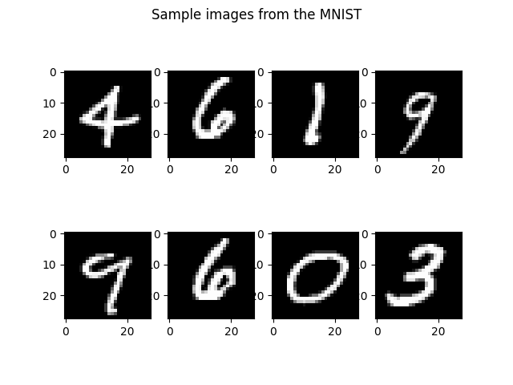
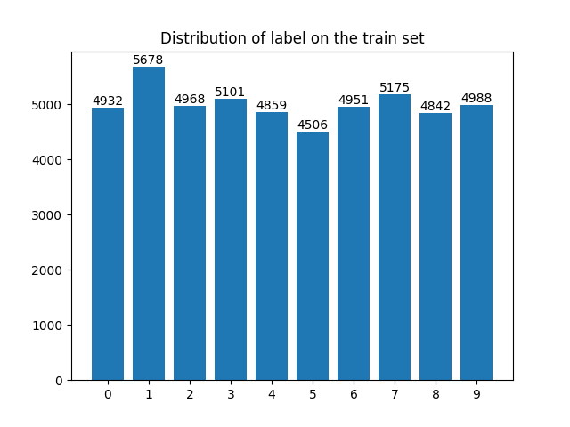
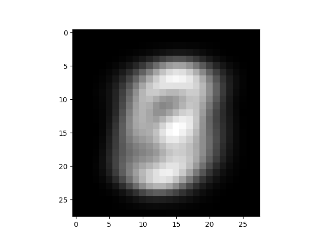
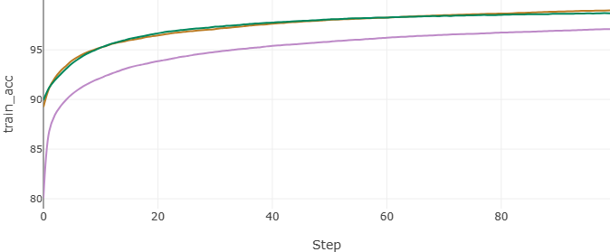
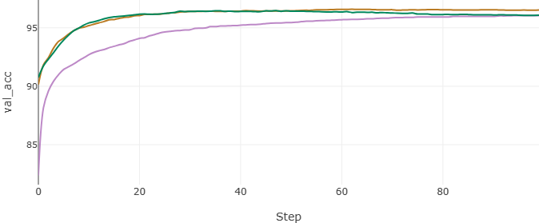
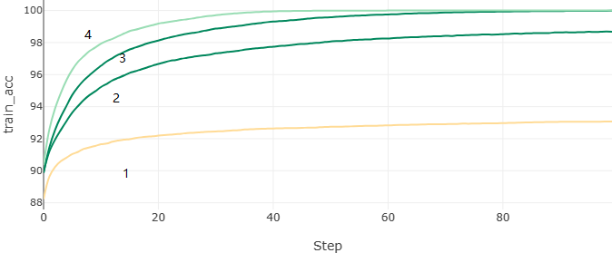
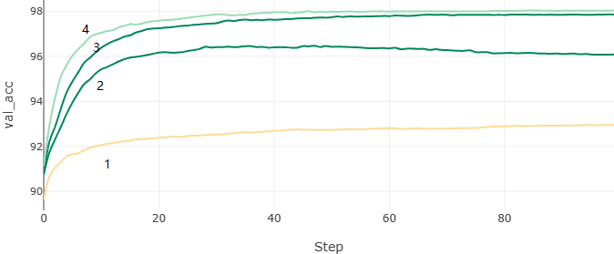

<div class="cover" style="page-break-after:always;font-family:方正公文仿宋;width:100%;height:100%;border:none;margin: 0 auto;text-align:center;">
    </br></br></br></br></br>
    <div style="width:60%;margin: 0 auto;height:0;padding-bottom:40%;">
        
	</div>
    </br></br></br></br></br></br></br></br>
    <span style="font-family:华文黑体Bold;text-align:center;font-size:20pt;margin: 10pt auto;line-height:30pt;">基于Numpy实现的多层感知机</span>
    <p style="text-align:center;font-size:14pt;margin: 0 auto">MNIST手写数据集 </p>
    </br>
    </br>
    <table style="border:none;text-align:center;width:72%;font-family:仿宋;font-size:14px; margin: 0 auto;">
    <tbody style="font-family:方正公文仿宋;font-size:12pt;">
    	<tr style="font-weight:normal;"> 
    		<td style="width:20%;text-align:right;">姓　　名</td>
    		<td style="width:2%">：</td> 
    		<td style="width:40%;font-weight:normal;border-bottom: 1px solid;text-align:center;font-family:华文仿宋"> </td>     </tr>
    	<tr style="font-weight:normal;"> 
    		<td style="width:20%;text-align:right;">学　　号</td>
    		<td style="width:2%">：</td> 
    		<td style="width:40%;font-weight:normal;border-bottom: 1px solid;text-align:center;font-family:华文仿宋"></td>     </tr>
    	<tr style="font-weight:normal;"> 
    		<td style="width:20%;text-align:right;">日　　期</td>
    		<td style="width:2%">：</td> 
    		<td style="width:40%;font-weight:normal;border-bottom: 1px solid;text-align:center;font-family:华文仿宋">2023-05-30</td>     </tr>
    </tbody>              
    </table>
</div>


<!-- 注释语句：导出PDF时会在这里分页 -->


# 基于Numpy实现的多层感知机-MNIST手写数据集

<center><div style='height:2mm;'></div><div style="font-family:华文楷体;font-size:14pt;">Doctor</div></center>
<center><span style="font-family:华文楷体;font-size:9pt;line-height:9mm">南京大学计算机科学与技术系</span>
</center>
<div>
<div style="width:52px;float:left; font-family:方正公文黑体;">摘　要：</div> 
<div style="overflow:hidden; font-family:华文楷体;">本报告旨在介绍使用多层感知器（MLP）进行手写数据集识别的任务。在当今的机器学习和人工智能领域中，神经网络是一种非常重要且强大的模型，它模拟了人脑中神经元之间的相互连接，并能够学习和推理。MLP是一种最常见的神经网络结构，它由多个层级的神经元组成，每个神经元与上一层的所有神经元相连，通过训练来学习输入数据的特征并进行分类。本次作业使用的数据集是手写数据集，它是一个广泛应用于机器学习的基准数据集之一。该数据集包含了大量手写数字的图像样本，每个样本都有相应的标签表示数字的值。手写数据集对于模式识别和图像分类任务具有重要意义，它可以帮助我们理解和解决实际中的许多问题，例如手写数字识别、邮政编码识别等。</div>
</div>
<div>
<div style="width:52px;float:left; font-family:方正公文黑体;">关键词：</div> 
<div style="overflow:hidden; font-family:华文楷体;">多层感知机；深度学习；神经网络</div>
</div>


# Numpy-based implementation of a multi-layer perceptron - MNIST handwritten dataset

<center><div style='height:2mm;'></div><div style="font-size:14pt;">Doctor</div></center>
<center><span style="font-size:9pt;line-height:9mm"><i>Nanjing University</i></span>
</center>
<div>
<div style="width:82px;float:left;line-height:16pt"><b>Abstract: </b></div> 
<div style="overflow:hidden;line-height:16pt">The aim of this report is to introduce the task of handwritten dataset recognition using a multilayer perceptron (MLP). In today's machine learning and artificial intelligence fields, neural networks are very important and powerful models that mimic the interconnections between neurons in the human brain and are capable of learning and reasoning.MLPs are one of the most common neural network structures that consist of multiple layers of neurons, each connected to all the neurons in the previous layer, that are trained to learn the features of the input data and perform classification. The dataset used for this assignment is the handwriting dataset, which is one of the benchmark datasets widely used for machine learning. The dataset contains a large number of image samples of handwritten digits, each with a corresponding label indicating the value of the digit. The handwritten dataset is important for pattern recognition and image classification tasks, and it can help us understand and solve many practical problems, such as handwritten digit recognition, postcode recognition, etc.</div>
</div>
<div>
<div style="width:82px;float:left;line-height:16pt"><b>Key Words: </b></div> 
<div style="overflow:hidden;line-height:16pt">Multi-layer Perceptron; Deep Learning; Nerual Network</div>
</div>


## 实验环境

本实验代码使用Python3.10开发，主要依赖Numpy库，具体依赖的第三方库如下:

```python
numpy # 矩阵运算
scipy # 数据集划分
alive-progress # 进度条
mlflow # 实验跟踪
```

其他均为标准库。

文件目录结构如下：

```bash
functional.py # 定义激活函数与其导数
train.py # 主函数
network.py # 定义模型
```

## 数据集分析

MNIST是一个手写数字数据集，由train, val, test三个子数据集构成，其中train set有50000个样本，val set和test set各有10000个样本。每个样本是有data和label两个域构成的，data部分是一个长度为784的向量，其中各个元素的取值在0-1之间，表示一个像素点的灰度值大小，长度为784的向量可以理解为一个28*28的单通道灰度图。以下分别是数据集的预览。



本文也考察了数据集在各个标签上的分布情况，以train set为例，下图比较了10个标签上样本数量的不同，可以清楚的发现，标签1是最多的，标签5则相对较少。总体上样本分布是均匀的，10个标签均匀地占有50000个标签的10%，也就是每个标签大致有5000个样本。



由于手写的字迹通常居中，所以图像的边缘通常是黑色的，下图是在train set上所有图片的均值图像，可以发现有大量的黑边存在，这些信息在不同label上保持一致，对训练分类模型没有用处，也说明模型存在优化的空间。



## 实验结果

本报告比较了三种不同激活函数的效果，比较了网络深度和网络宽度对效果的影响，具体如下。

### 激活函数

本报告比较了三种激活函数，分别是sigmoid（紫色）, tanh（黄色）, ReLU（绿色）。实验均训练100个epoch，学习率1e-2，各层神经元个数[784, 30, 10]。训练与验证准确率如下：





在训练集上，sigmoid作为激活函数时表现较差，tanh与ReLU的表现基本一致。在验证集上，sigmoid作为激活函数时表现也较差，ReLU比tanh更早达到最优表现，此后tanh表现较为稳定，ReLU出现过拟合现象。

### 网络宽度与深度

本报告也比较了网络深度与宽度对模型表现的影响，具体如下：

| 序号 | 神经元个数         | 测试集准确率 | 激活函数 | 图例颜色 |
| ---- | ------------------ | ------------ | -------- | -------- |
| 1    | [784, 10]          | 92.52%       | ReLU     | 黄色     |
| 2    | [784, 30, 10]      | 96.36%       | ReLU     | 浅绿     |
| 3    | [784, 256, 10]     | 97.73%       | ReLU     | 深绿     |
| 4    | [784, 256, 64, 10] | 97.99%       | ReLU     | 天蓝     |

我们可以发现，对比1、3可以发现，提升模型深度有助于提高模型表现，类似地，对比2、3可以发现，提升模型的宽度也有助于提模型表现。对比1、4可以发现，同时提高两者也对模型有提高，但不是单纯的线性提高的关系。





## 模型的进一步提高

模型仍有提升的空间，首先在部分实验上，模型存在过拟合的现象，train上表现随训练次数提升更好，但val上下降。此时可以使用early-stop，在出现过拟合的时候停止训练。也可以采用其他类型的更适合处理图像的神经网络模型，或引入归一化、dropout和其他的数据预处理或正则化技术。
